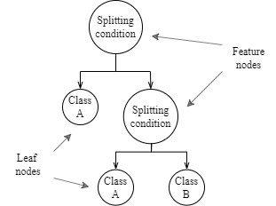

# Decision Tree
Classification decision tree structure with machine learning algorithm.

## Problem description
Determine iris flower specie based on size of its petals and sepals.

We have dataset which contains records for 3 iris species.

## Structure function
Decision tree structure works on data splitting principle. Generally speaking, tree structure is build from nodes. In this case we talk about feature node and leafs. Each node has a maximum of 2 children.

Feature nodes represents condition. In these nodes input data are split into two paths (left or right) based on splitting condition. Splitting condition is build from feature and threshold. Feature represents the "column" of input data and threshold the value for comparing. These nodes are characterized by 4 attributes. Left child, right child, feature and threshold.

Left path

$input(feature) \leq threshold$

Right path

$input(feature) > threshold$

Leaf nodes don't have children. That means that they are not splitting the input and path ends there. These nodes represents the output classes which represents the result (prediction) of the structure.

When finding the output prediction the input will travel trough the tree structure and whichever leaf it end up on is the output.

*Decision tree scheme*

## Structure training
In case of decision trees training means building the tree structure. Building means creating the nodes and their connections. Training is based on supervised learning principle.

Most complex task of building the tree is to find the optimal splitting condition. For this purpose entropy and information gain calculation is used.

The algorithm tries each feature and each of it value to find the most optimal splitting condition. From these optimal parameters feature nodes are created. If all values from a divides set are from one class a leaf node for this class is created. Leaf node is also created when the set cannot be split anymore. This happens when number fo values in the set is lower or matches the minimum split value (this determines from how many values the set won't be split) which is training parameter. Another case of leaf node is when maximum depth of the tree is reached. Depth is also training parameter and in both of these cases the value of that node is determined by most common class in that set.

Training ends when full tree is constructed or maximum depth reached.

### Formulas
Entropy calculation

$E = -\sum_i(p_i * log_2(p_i))$

*p_i is probability of class i*

Information gain calculation

$gain = E(parent) - \sum_i(w_i * E(child_i))$

*Entropy of parent node - entropy of children nodes*

*weight w_i represents the size of child set related to the original set in parent*

## Implementation
In this example the dataset was split into training and testing data. Before splitting the records were randomly shuffled, because by default the data is ordered by species which would lead to not ideal training performance after splitting.

### Model functionality
When training (building) user must provide training data, labels and set maximum depth and minimum split. Then the tree is recursively build.

With built tree a single output can be predicted with predict or testing with set of testing data and labels can be done. Testing returns model accuracy.

On top of that tree structure can be printed into console. Available prints are: pre-order, in-order and post-order.

### Testing
Testing was done with 130 training samples and 20 learning samples. Result of testing was 95% model accuracy.

## Notes
- Depth is starting at 0.
- Print functions are just bonus and does not affect the model functionality.
- Shuffling the data before splitting boosted accuracy by 10%.
- When calculating entropies labels should be used (not values).