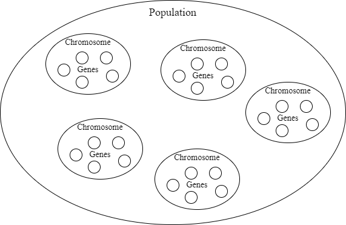
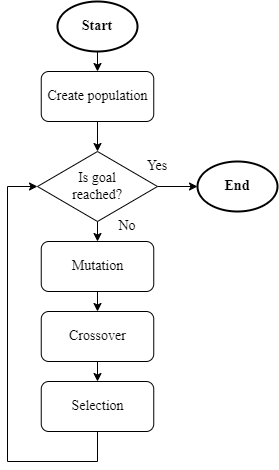
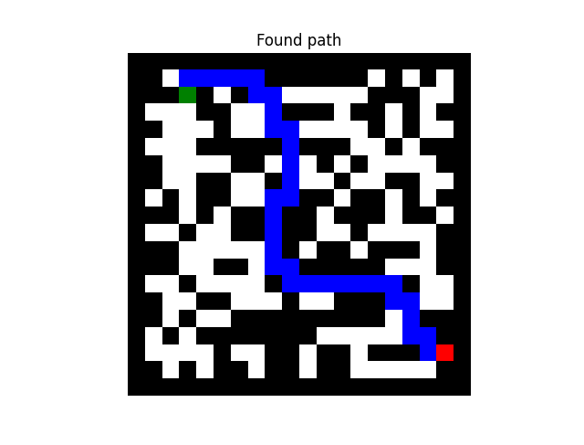
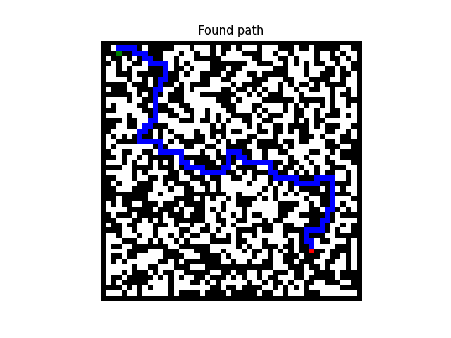

# Genetic algorithm
This kinda isn't a machine learning problem, but it also seems interesting to me and wanted to give it a shot with implementation.

## Problem description
We want to generate a maze with guaranteed solution.

## Function
Function of genetic algorithms find similarities in genetic. To be more specific in evolution.

Building block of genetic algorithm is a chromosome. This represents the individual (in our case the maze). Chromosome consists genes which characterize it. When we have a group chromosomes, we can say that we have a population.

*Terminology illustration*

Inside the population we define following actions. Mutation is when genes of some chromosome are changing (typically randomly). Second action is a crossover which means that genes of two chromosomes are combined (similar to two parents having a baby). Last important action is a selection. Selection determines which chromosomes will survive (go to another generation) and which will die.

Repeating this action in a cycle will result in a evolving genetic algorithm.

*Genetic algorithm evolution flowchart*

Another thing we need to specify is how to determine which chromosome is better (closer to our goal) and which worse for the selection. Basically we need something so we can compare them. For this purpose there is a fitness function. This function gives each chromosome a fitness score (score determines how good the chromosome is for our application). Design of the fitness function is very important and specific for each application.

Tournament method is a simple selection algorithm that was used in this example. What it basically does is that it takes two random chromosomes and keeps the better one (higher fitness score).

## Implementation

### Fitness function
For purpose of a fitness function an A* search algorithm was implemented. This algorithm is designed to find a path in a maze and uses priority queue (each step has its costS). Result of it says if the maze (chromosome) has a solution. If it has solution in returns the path (from start to finish) and if not it returns the cost of position at which it terminated. Fitness score is than based on this result.

<table>
    <tr>
        <th>Solution</th>
        <th>A* result</th>
        <th>Fitness score</th>
        <th>Score value</th>
    </tr>
    <tr>
        <th>Exists</th>
        <th>Path with multiple steps</th>
        <th>Positive</th>
        <th>Number of steps</th>
    </tr>
    <tr>
        <th>Doesn't exist</th>
        <th>Cost different than 0</th>
        <th>Small negative</th>
        <th>1 - cost</th>
    </tr>
    <tr>
        <th>Doesn't exist</th>
        <th>0 cost</th>
        <th>Large negative</th>
        <th>-maze size</th>
    </tr>
</table>

Last case of the table means that the starting point is surrounded with walls (there are no available moves from the beginning).

### Functionality
Algorithm returns the first maze with found solution. In addition it returns also the path from start to finish.

User input size of the population, number of chromosomes to mutate and cross over, probability of gene mutation and if the mutating and crossing chromosomes should be kept. As parameters of the maze user have to input size of it and can also specify the starting and finishing position.

Mutations and cross overs are implemented with weight for supporting earlier convergence. This means that chromosomes with higher fitness score are less likely to be mutated and more likely to keep genes when crossing over.

### Results

*20 x 20 generated maze*

*50 x 50 generated maze*

## Notes
- Algorithm convergence is very random.
- Usage of custom class to represent a maze.
- Usage of self implemented A*.
- Weighted mutations aren't applied in this example (it returns the first case where solution exists), but the logic is implemented.