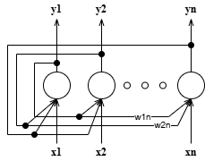
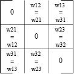
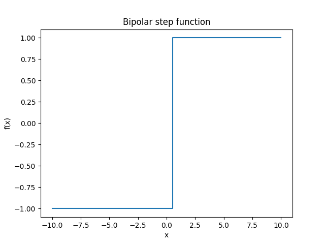
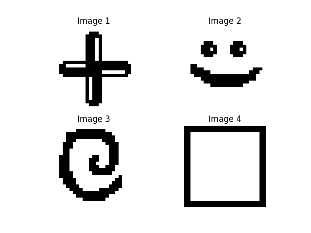
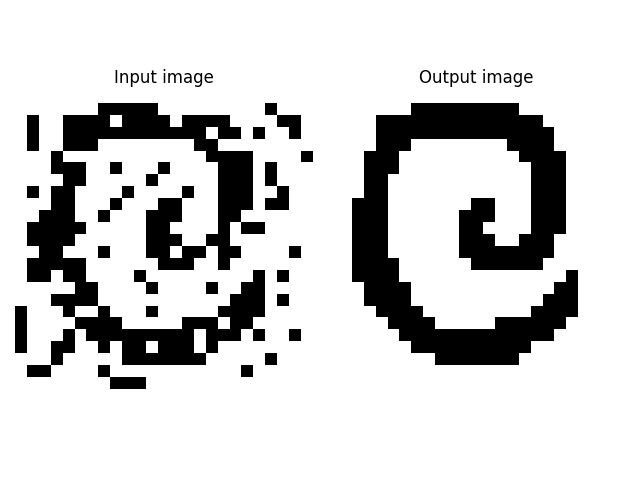
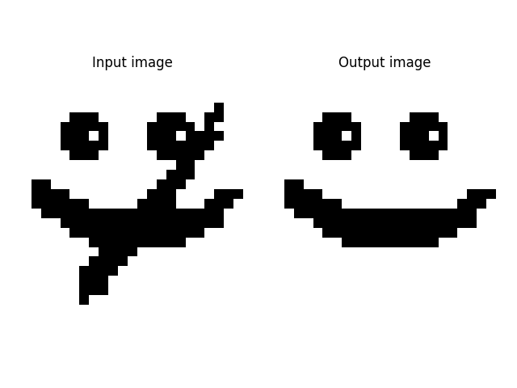
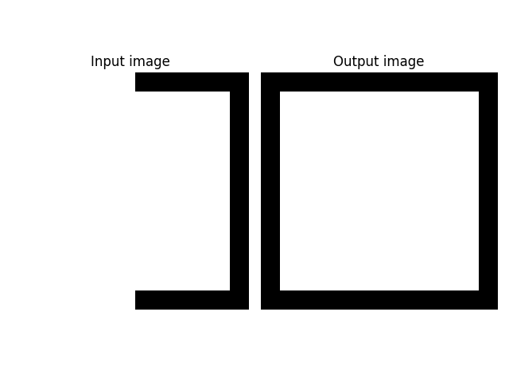
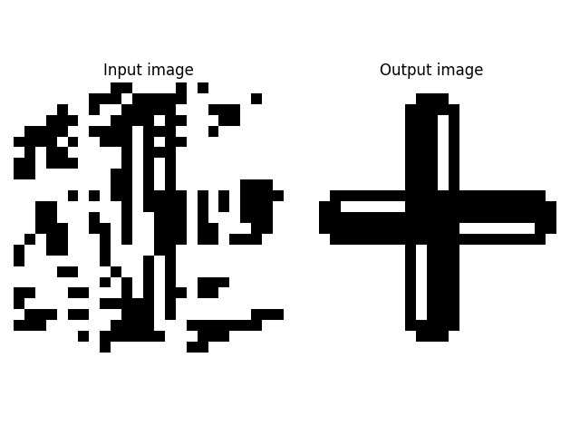

# Hopfield Network
Discrete Hopfield network with associative memory.

## Problem description
We have set of corrupted patterns and want to reconstruct them with the knowledge of the original patters.

In this example there are 4 25x25 pixels images.

## Network function
Hopfield network is type of network that uses memory. It is learned for some patterns and then reconstruct the most similar pattern from some kind of noisy input. To achieve this functionality it uses feedback connections where output of each neuron is a input for all others neurons.

Hopfield networks have typically single layer topology where number of neurons is the same as number of input values. Each input is connected to only one neuron without weights. Weighted connections are the feedback ones.

Number of patterns the network can learn isn't unlimited.

$patters < 0.15*neurons$

Number of patters must be lower than 0.15 * number of neurons (inputs). But what is probably bigger limitation is that training patters must be different enough from each other. If they're not the network will kinda mix them together and the reconstructed output won't be any of the learned patters.

*Hopfield network scheme*

## Network training
Training is one step process. In this step all training patterns are input into network and weights are set. Matrix of weights has size of number of neurons X number of neurons. Also their are symmetrical by main diagonal, values on main diagonal are 0 (0 denies feedback to the same neuron).

*Weights matrix*

$w = \sum_i(x_i * x_{i}^{T})$

*and w = 0 on main diagonal*

*Weights with bipolar activation function*

## Reconstructing
Reconstruction (means wanting a output from learned network for input sequence) is an iterative process. In each iteration the network changes its state (output). For first iteration the state is the same as input values. On next iteration these states (outputs of each neuron) are fed to the other neurons (weighted feedback connection). In this step the state changes. From now on in each iteration inputs of neurons are current outputs (state). This way the state is changing until it is the same for two iterations that are after each other. This moment means that the network is in steady state and the state (output) is one of the learned patters.

$state_0 = x$

$state_{next} = f(\sum_i(w_i*state_{current_i}))$

*f(x) is an activation function*

## Implementation
Network is designed to reconstruct black and white square images. In this example 25x25 pixels.

### Activation function
As activation function bipolar step function was used.

*Bipolar step function*

$$
f(x) = 
\begin{cases} 
-1 & \text{if } x < 0, \\
1 & \text{if } x \geq 0 
\end{cases}
$$

### Model functionality
Network can learn one or multiple patters that are parameters of learn method. When initializing model network size (number of neurons = number of input values) must be provided.

Reconstruct method can return either final state or array with all states from each iteration.

### Training
Network was trained to recognize 4 different images.

*Training images*

### Testing
Testing was done with 4 different types of image corruption.

*Test 1 with little noisy image*

*Test 2 with crossed out image*

*Test 3 with only half of the image*

*Test 4 with noisy image*

## Notes
- There is a BIG influence of similarities of training patterns when learning network for multiple patters.
- input sequence (image) should contain values -1/1 instead of 0/1.