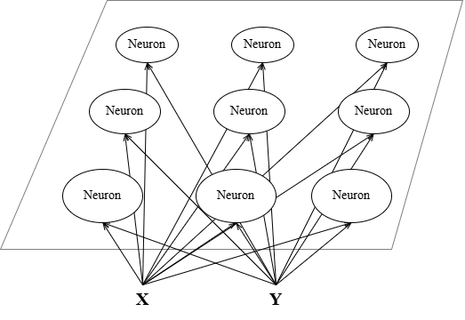
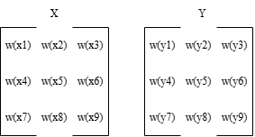
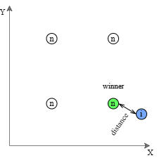
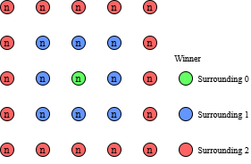
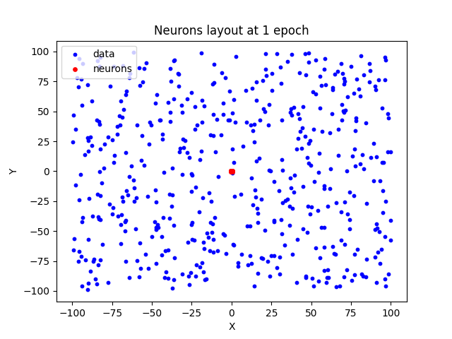
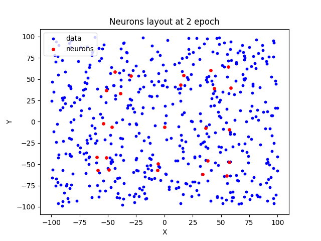
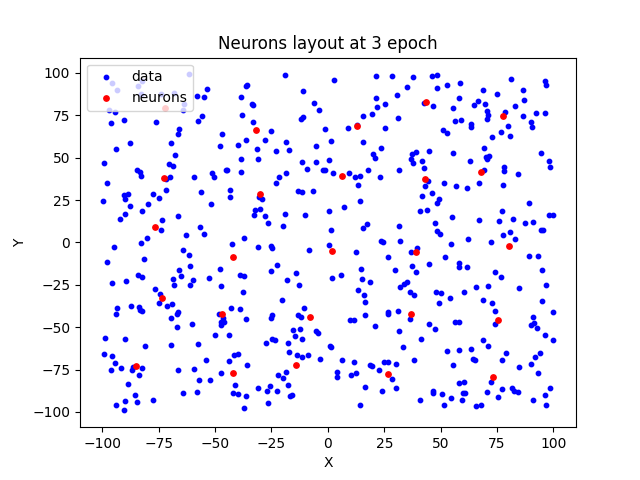
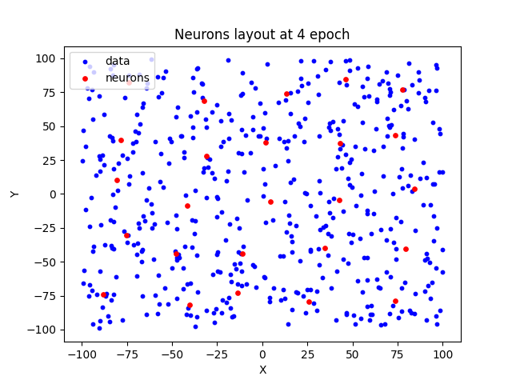
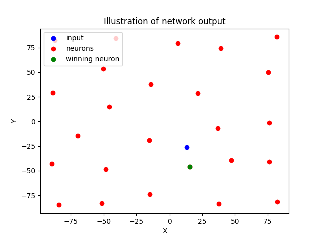

# Kohonen network
Kohonen network (SOM - Self-Organizing Map) of square shape for data clustering.

## Problem description
We have a set of data and want them to divide into groups (clusters).

In this example the data set consist of 2 values and we will divide them into 25 groups. This is because of clear graphical representation (2D plane) and simpler explanation.

## Network function
Kohonen network uses unsupervised learning method. This means that we simply input data into the network and it has to somehow process it. Typically it finds similarities between the values and creates groups of similar ones.

Topology of SOM is like a square matrix of neurons (square map). This can be imagined a plane of neurons which represents one layer. Each of these neurons is connected to each of the inputs.

*Network topology*

Weights of these neurons has 3 dimensions. First set number of input values. Second and third then represents rows and columns of weights matrix (this corresponds to the neuron position in space).

*Matrixes outline*

The network uses competitive principle. This means that for some input value only one output neuron is active (winner). Winning neuron is determined by its distance from the input value. The closest one is the winner.

*Competition showcase*

This way we have network of neurons in space. Each neuron represents one group. When we input some new data, the output will be the closest neuron to this input.

### Graphical explanation for the example
We we have 2 input values (x, y) and we are splitting them into 25 clusters. That means we will have 5x5 network of neurons. Now weights matrix has dimension (2, 5, 5). This means that there are 2 5x5 matrixes. First of these matrixes contains x-weights and second one y-weights (this corresponds to x and y coordinates of these neurons). This means that we can also plot the neurons into a 2D graph.

## Network training
Training consists of adjusting the neurons positions in space. Neurons don't have any activation function. Its output is based simply on the distance between them and input value.

When neuron wins (is the closest) weights of this neuron are adjusted. In addition we can adjust also the weights of the surrounding neurons. Surrounding 0 means that only winning neuron is moved.

*Surrounding outline*

After each epoch (training iteration) learning rate decreases and surrounding value decreases. These two parameters are for faster neurons moving at the beginning of the training. After couple of epochs the steps will be smaller which leads to more precise adjusting. Surrounding decreases only until it is 0.

Training end could be set by two different ways. First one is to set ending learning rate value and second one is to set number of training epochs.

### Formulas
$d_n = \sum_i(x_i - w_{ni})^2$

*Distance from neuron n*

$w_{i+1} = w_i + \alpha * (x - w_i)$

*Weights adjusting (alpha is learning rate)*

$\alpha_t = \alpha_0 * (1-\frac{t}{T})$

*Learning rate decrease for epochs controlled training (t is epoch, T total number of epochs, alpha_0 is initial learning rate value)*

## Implementation
Implementation was done for described example. That is 2 inputs and 25 clusters.

### Model functionality
When creating the model you have to set input size and number of neurons. Square root of number of neurons has to be an integer (because there is square shape map). When training user has to set learning rate and then there are couple of optional parameter:
- ending: value of learning rate when the training stops.
- decrease: value of learning rate decrease after each epoch. This is used only when training is controlled by ending.
- surrounding: neighbors of winning neuron to be adjusted as well.
- epochs: number of training epochs.
For training either ending plus decrease or epochs have to be set. One of these will determine when the training process ends.

### Training
Training was done with 500 random values in range from -100 to 100.

*Neurons layout at epoch 1*

*Neurons layout at epoch 2*

*Neurons layout at epoch 3*

*Neurons layout at epoch 4*

### Testing

*Network output illustration*

## Notes
- User must take care of input dimensions.
- When training controlled by epochs smaller learning rate is recommended.
