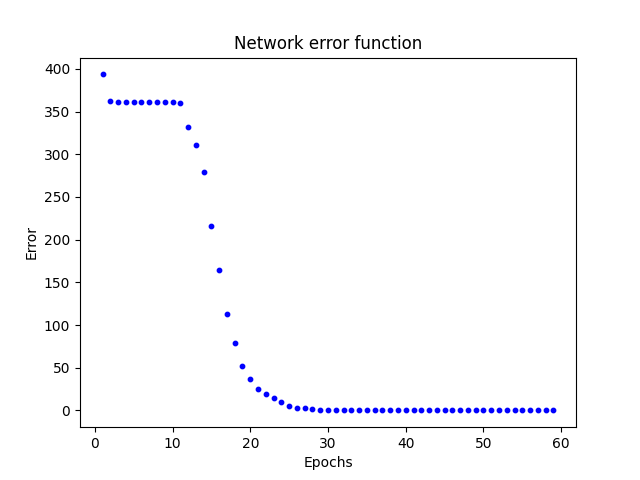

# Multi-Layer Network
Multi-layer neural network with back propagation to recognize a single digit from an image.

***Note: this page is about the model and its usage in "main.py" file.***

The "handwritten.py" script contains example of usage neural network model which is described later along with Mnist handwritten digits dataset.

## Problem description
Digit recognition from an image.

This is a classical classification problem. We have 10 training images which are 18x18 pixels. On each image is one number and we want to train the network to recognize these numbers.

This is a very basic because the training set contains only 10 samples and testing is done with the same noisy images. Goal of this project is to look at error back propagation.

## Network function
Multi-layer network we can generally split into tree parts.
1. First part is an input layer. This layer is typically linear which means that it only passes the input values. Number of neurons in this layer is set by number of input values.
2. Input layer is followed by hidden layers. Generally there can be any number of hidden layers with anu number of neurons.
3. Last layer is an output layer. Number of neurons in this layer is set by application (number of outputs is based on the problem). Outputs of these neurons are also outputs of the network.

*Network scheme*

Each neuron is specified by weights, bias and activation function.

Network with back propagation separates the classes with lines as boundaries (this comes from the way of calculating z). Multilayer network can also separate nonlinear input.

Property of this type of network is that every input is somehow classified. This means than unknown or even a wrong input is always assigned to some output. Wrong input is some input for which the network isn't trained (for example network is trained to recognize digits and we input a letter).

*Illustration of a multi-layer layer network separation*

## Network training
Training in this case was with back propagation method with parameters adjusting after each training sample.

### Back propagation
Error back propagation is an iterative gradient algorithm that minimizes the square of error function. Practically that means that error propagating from output back to input. This backwards propagation helps adjust weights and biases. Overall goal is to find the minimum of networks loss (error) function. This method is used with supervised learning (because we need to be able to calculate error).

### Training

The training process then can be split into tree steps.
1. Forward pass: training data are input into the network and outputs of each neuron is calculated. At the end there are predictions fo the output layer.
2. Backward pass: we count the error of the output (based on labels of training data). This error is then propagated from the output layer back to the input layer. On the way errors for each neuron is counted.
3. Adjusting: based on neurons outputs and their errors adjusting of the weights and biases is done.

In this example in addition to learning rate which defines the adjusting steps a momentum is also defined. With momentum we determine how much the weights or biases are changing in each iteration. The bigger changes the bigger adjusting steps. Momentum should help network to converge faster (converge means that the network is trained).

*Error function without momentum*

*Error function with momentum*

*Note: in both cases training was done with same learning rate and on average learning with momentum converge twice as fast.*

### Formulas

Output of a single neuron:

$y = f(z)$

$z = \sum_{i}(w_{i} * x_{i}) + b$

*f(z) is an activation function*

Errors:

$E_{sample} = \frac{1}{2} \sum_i(d_i - y_i)^2$

*labels - outputs*

$E_{network} = \sum_i(E_{sample_i})$

Back propagation:

$\delta = (d - y) * \frac{df(z)}{dz}$

*For output layer (labels - outputs)*

$\delta = \sum_i(w_i * (d_i - y_i)) * \frac{df(z)}{dz}$

*For hidden layers (error from previous layer * weights of previous layer, starting at the output layer)*

Adjusting:

$w_{i+1} = w_i + rate * \delta * input$

$b_{i+1} = b_i + rate * \delta$

*rate is learning rate and input is input of that layer (neuron) not network input (except the first layer)*

$w_{i+1} = w_i + rate * \delta * input + momentum * (w_i - w_{i-1})$

$b_{i+1} = b_i + rate * \delta * input + momentum * (b_i - b_{i-1})$

*With momentum*

## Implementation

### Topology
Because we have 18x18 input images the input layer contains 324 (18 * 18) input values. Then there are 2 hidden layers. First one has 40 neurons and second has 20. Output layer has 10 neurons (for digits 0-10).

### Activation function
As activation function hyperbolic tangent (tanh) function was used.

*Hyperbolic tangent function*

$f(x) = \frac{1 - e^{-x}}{1 + e^{-x}}$

$f(x)' = 1 - f(x)^2$

### Functionality
Weights and biases are randomly generated for each network object.

When training training data, training labels, learning rate and acceptable error must be provided. Optionally momentum, epochs and if a network error development graph should be shown. Training will end either when the network error is lower than the acceptable error or when training process reaches max iterations (set by epochs parameter.)

*Testing input*

*Result to testing input*

*Note that testing was done with noisy training images*

## Notes
- When i was using sigmoid function as an activation function the network didn't converge.
- Momentum really speed up the training process.
- Learning rate, momentum, initial weight and initial biases - each of these has noticeable influence on network convergence.
- The biggest challenge of this project were mathematics behind the back propagation and tracking all the values in matrixes. To look for right dimensions and right operators.
- Training with huge amount of training samples is really slow (for these cases training with batches could be better)

### Results from handwritten.py example

*Network error function*

*Network output for 100 testing samples*