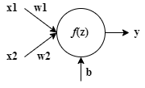
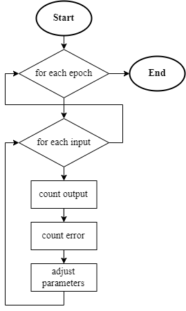
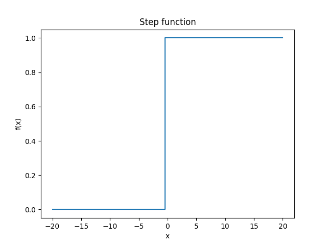

# Perceptron
Perceptron means one neuron and is the easiest block of neural network.

In this example single perceptron is used to approximate logical gate function (OR or AND).

## Problem description
We have combination of 2 bits as an input and want to decide what should be at the output (0 or 1). The output will depend in the selected logical gate.

<table>
  <tr>
    <th colspan="2">Input</th>
    <th colspan="2">Output</th>
  </tr>
  <tr>
    <th>x1</th>
    <th>x2</th>
    <th>OR</th>
    <th>AND</th>
  </tr>
  <tr>
    <td>0</td>
    <td>0</td>
    <td>0</td>
    <td>0</td>
  </tr>
  <tr>
    <td>0</td>
    <td>1</td>
    <td>1</td>
    <td>0</td>
  </tr>
  <tr>
    <td>1</td>
    <td>0</td>
    <td>1</td>
    <td>0</td>
  </tr>
  <tr>
    <td>1</td>
    <td>1</td>
    <td>1</td>
    <td>1</td>
  </tr>
</table>

## Perceptron function
We can imagine perceptron as a mathematical function. It takes multiple input values and returns one output value. Perceptron is defined by his weights (w) and bias (b). Weights determine how much each of the input values impact the output. So number of weights that perceptron has is directly set by number of input values. On the other hand bias is just one value which "offsets" the neuron. In more complex network bias determines how much that neuron impacts the output value.

*Perceptron representation*

$z = \sum_{i}(w_i * x_i) + b$

$y = f(z)$

Function *f(z)* is referred to as activation function where *z* represents the perceptron potential.

## Perceptron learning
In this model supervised learning principle was used. Supervised means that the model was trained with labeled training data. Training data represents inputs for the perceptron and each training input has a label. Label is a value that should be outputted.

Learning is an iterative process. In each iteration perceptron counts output value. This value is then compared to the label. If there is a difference the weights and bias is adjusted. In each iteration all training data is showed to the model.

Number of iterations could be set two ways in this case. First one is that learning process go on until the weights and bias stop changing. Second one is by explicit saying number of iterations (epochs).

*Perceptron learning flowchart (with set number of iterations (epochs))*

$error = label - prediction$

$weights_{i+1} = weights_i + error * rate * input$

$bias_{i+1} = bias_i + error * rate$

New parameter here is a learning rate. This parameters is applied to the learning process. Learning rate value impacts the changes to the weights and bias in each adjusting calculation. Bigger rate means bigger changes.

## Implementation
Perceptron activation function is a simple step function.

$$
f(x) = 
\begin{cases} 
0 & \text{if } x < 0, \\
1 & \text{if } x \geq 0 
\end{cases}
$$

When creating the Perceptron instance you must set the input_size parameter (number of inputs) and optionally you can set starting weights and bias (if you don't these value will be set randomly in range 0-1).

When you want to train the perceptron you must provide the training data and labels (desired outputs). Optionally you can provide learning rate (default value is 0.1) and number of epochs (if you don't model will train until weights and bias stop changing).