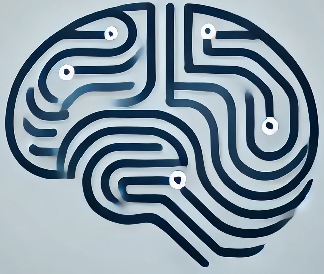

# AI Fundamentals

## About
This repository is about my entrance to the machine learning problematic and track my journey to learn and understand ML fundamentals. The learning process is based on creating the networks from scratch.

*Image is AI generated*

## Layout
Repository layout is simple. Each folder contains one "model". Each model is somehow different and each one is separately documented. The documentation is written in my own words and mirrors how I understand the problem and implemented the model. Part of every folder is also at least example of usage. My insights are also recorded there.

<table>
    <tr>
        <th>Folder</th>
        <th>Description</th>
        <th>Example</th>
    </tr>
    <tr>
        <th>Perceptron</th>
        <th>Single neuron</th>
        <th>Logical gates</th>
    </tr>
    <tr>
        <th>SingleLayer</th>
        <th>Single layer network with multiple neurons</th>
        <th>Morse numbers decoder</th>
    </tr>
    <tr>
        <th>MultiLayer</th>
        <th>Multi-layer network with back propagation</th>
        <th>Digits recognition from an image</th>
    </tr>
    <tr>
        <th>Hopfield</th>
        <th>Discrete Hopfield network</th>
        <th>Images reconstruction</th>
    </tr>
    <tr>
        <th>Kohonen</th>
        <th>Kohonen network (SOM - self-organizing map)</th>
        <th>Data clustering</th>
    </tr>
</table>