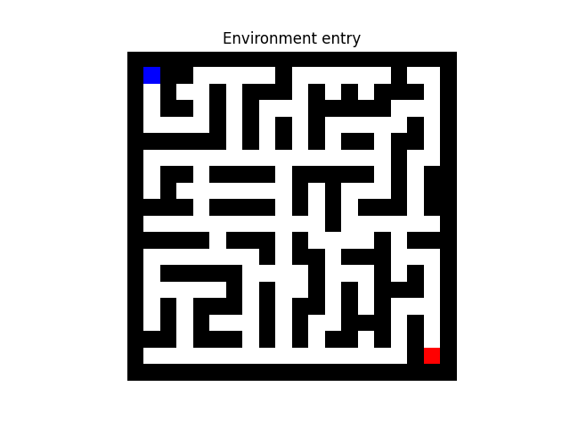
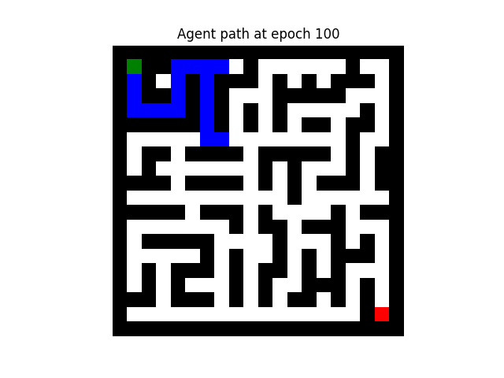
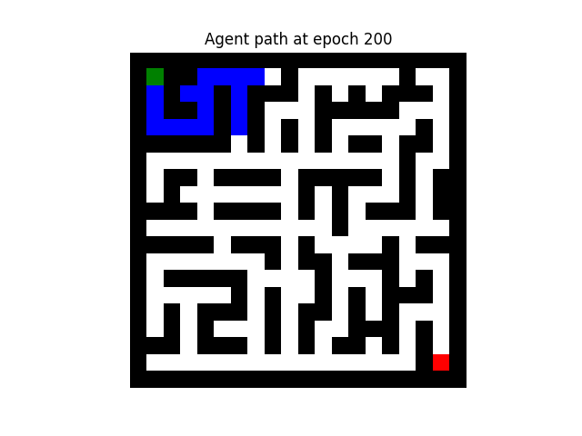
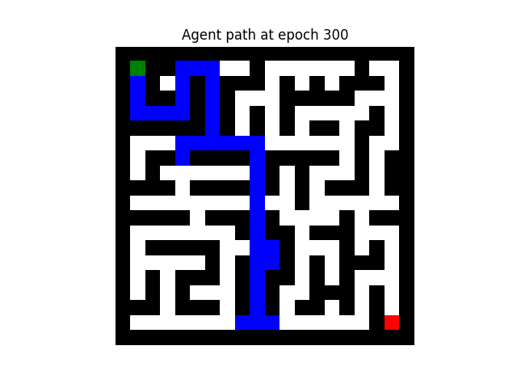
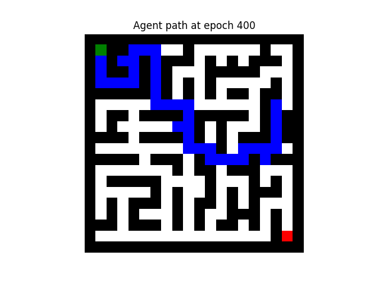
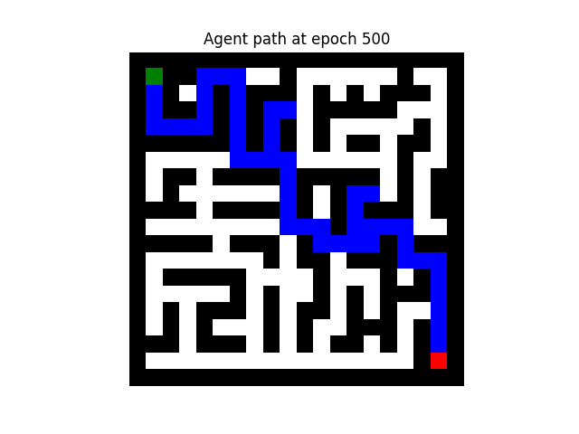
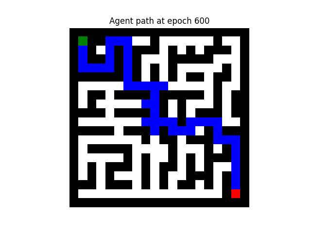
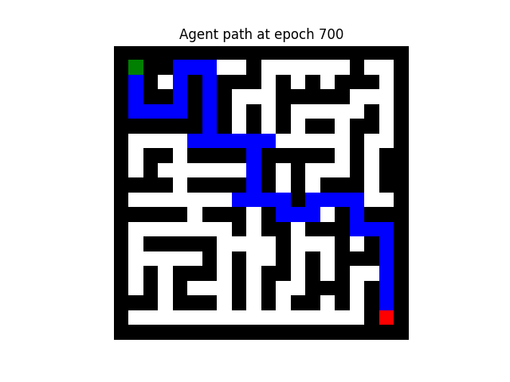
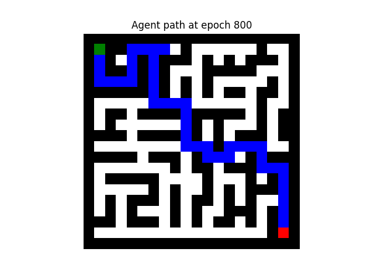
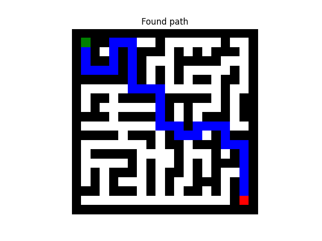

# Reinforcement learning
Reinforcement learning model for maze solving.

## Problem description
We have a maze and want to find path from a start to the finish.

## Structure function

### Reinforcement learning
Principle of reinforcement learning is built from 3 main components. These are agent, environment and rewards.

Agent is our program. Agent interacts with the environment and executes actions in it. In our case a maze is the environment and actions which the agent can do are moving in it. Purpose of reward system is to tell the agent if his actions were good or bad.

### Q-learning
The principle of Q-learning algorithm is that we have defined Q-table that maps a value to the agent state and actions.

For better understanding let's get to the maze example. Q-table will have size of the maze (to represent each possible agent state = position). In addition we will have this table for each agents available action. So Q-table will have record for each agents possible state and its possible following action.

Values for Q-tables depend on a reward from the action on that state. This means that it reflects how good the action is from the current state. 

### Agent training
Agent behavioral in the environment can be split into two domains. These are exploration and exploitation.

Exploration means that the agents next step will be random. This causes that the agent can explore new parts of the environment that he possibly never seen before.

Exploitation on the order hand means that next step will be determined by the Q-table. This will result in the best possible step. But what should be noted is that the best step might not be actually best because it depends on the agents knowledge of the environment.

Updating the Q-table record for state S and action A:

$Q(A, S) = Q(A, S) + \alpha * (reward + \gamma * Q_{max}(A_{next}, S_{next}) - Q(A, S))$

*Q_max represents maximum value (that is the best action) from the following state (state of next iteration)*

We have a agent with set of his possible actions in an environment. The first step is that agent needs to decide his next action (step). For choosing the next action epsilon-greedy principle was used.

### Epsilon-Greedy principle 
We will use the epsilon-greedy to determine agents next move. The choice between exploration and exploitation is controlled by epsilon value. Epsilon represents a probability of exploration.

At the beginning of the learning process the epsilon is 1 or near to 1 to allow the agent explore the environment and update his Q-table. Over time epsilon decreases to allow the agent make good and effective actions.

## Implementation
Agent will interact with Maze class. All the environment information is there. Like start, finish and current position, moves validation, moves taken, .... When agent will provide these information with his own methods.

Q-table is implemented as dictionary where keys are actions and values are matrixes.

### Example
The agent will travel through a 20x20 pixels maze where each pixel represents cell of the maze. This maze is then represented as 20x20 matrix. Maze is loaded form an image.

Types of cells in the maze.
<table>
    <tr>
        <th>Type</th>
        <th>Color</th>
        <th>Value in matrix</th>
    </tr>
    <tr>
        <th>Wall</th>
        <th>Black</th>
        <th>0</th>
    </tr>
    <tr>
        <th>Start</th>
        <th>Green</th>
        <th>1</th>
    </tr>
    <tr>
        <th>Empty cell</th>
        <th>White</th>
        <th>2</th>
    </tr>
    <tr>
        <th>Finish</th>
        <th>Red</th>
        <th>3</th>
    </tr>
</table>

In addition we define.
<table>
    <tr>
        <th>Moving point</th>
        <th>Blue</th>
        <th>1</th>
    </tr>
    <tr>
        <th>Path</th>
        <th>Blue</th>
        <th>4</th>
    </tr>
</table>

*These are special for each method*

### Model functionality
When initializing the agent it needs a path to the maze image, his actions list and optionally we can define if we want to display the loaded maze.

For agents learning we need to provide learning rate, discount factor, minimum value of epsilon, number of epochs, maximum number of steps. Optionally we can choose to stops learning after hitting the finish for the first time (there won't be path optimization) and list of epochs in which we want to display actual learning state.

<table>
    <tr>
        <th>Parameter</th>
        <th>Description</th>
    </tr>
    <tr>
        <th>Alpha</th>
        <th>Learning rate, changes size of steps in Q-table values adjusting</th>
    </tr>
    <tr>
        <th>Gamma</th>
        <th>Discount factor, determines importance of future step</th>
    </tr>
    <tr>
        <th>Epochs</th>
        <th>Number of times the agent will go trough the maze</th>
    </tr>
    <tr>
        <th>Max steps</th>
        <th>Maximum number of steps in each epoch</th>
    </tr>
    <tr>
        <th>Display</th>
        <th>On provided epochs display current score and last travel through the maze</th>
    </tr>
</table>

### Training
Initial epsilon is 1 (100% exploration) and is decreased every epoch until it reaches minimum epsilon value.

Epsilon decreasing:

$\epsilon_{t+1} = \epsilon_{t} - \frac{(1 - \epsilon_{min})}{epochs}$

Rewarding system
<table>
    <tr>
        <th>Action result</th>
        <th>Reward</th>
    </tr>
    <tr>
        <th>Hitting wall</th>
        <th>-10</th>
    </tr>
    <tr>
        <th>Valid move</th>
        <th>-1</th>
    </tr>
    <tr>
        <th>Reaching finish</th>
        <th>+100</th>
    </tr>
</table>

### Results
Training for 1000 epochs with learning rate 0.7, discount factor 0.8, minimum epsilon 0 and maximum steps 100.

<table>
    <tr>
        <th></th>
        <th></th>
    </tr>
    <tr>
        <th></th>
        <th></th>
    </tr>
    <tr>
        <th></th>
        <th></th>
    </tr>
    <tr>
        <th></th>
        <th></th>
    </tr>
    <tr>
        <th></th>
        <th></th>
    </tr>
    <tr>
        <th></th>
        <th></th>
    </tr>
</table>

We can see that from epoch 500 (rough approximation) the agent knows the path and from now it optimize it for minimum steps.

The best path agent found was 42 steps.

### Notes
- Q-table is a dictionary.
- Usage of custom Maze class as environment.
- Lower minimum epsilon leads to better path optimization and fixed isn't performing well.
- Higher max steps leads to faster finding the goal (terms of epochs) but with higher steps.
- With too small discount factor the agent will always oscillate around start.
- A* search algorithm found the exactly same path (implemented in Genetic folder).