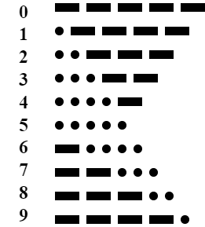
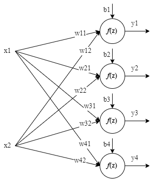
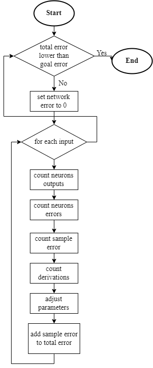
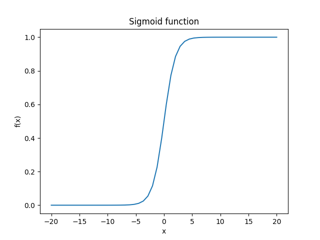
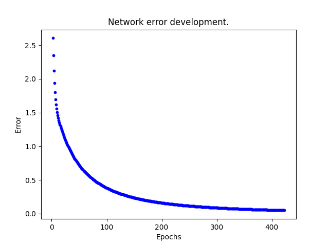
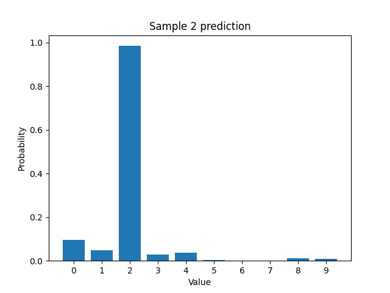

# Single Layer Network
Neural network with one layer which has multiple neurons.

## Problem description
Morse code number decoder.

*Numbers in Morse code*

## Network function
The neural network is built from neurons. Each neuron has its own weights and bias. Each neuron has same input (all input values) so they need to have different parameters (weights and bias) so each works as different gate.

*Network scheme*

$z_j = \sum_{i}(w_{ji} * x_{ji}) + b_j$

$0 < j \leq n$

*(n is total number of neuron)*

$y_j = f(z_j)$

Function *f(z)* is referred to as an activation function where *z* represents the neuron potential.

## Network training
In this example supervised training principle was used. That means that network was trained with labeled training data.

Learning is an iterative process. In each iteration a network error value is count. This value is a summary of errors for each sample which are summaries of errors of each neuron. Goal is to minimize the error value by adjusting each neurons weights and bias.

Number of iterations can be set in two ways in this example. First one is to set number of epochs. Second one is to set a goal error value. Training will then go until the network error is lower than the set value.

*Network learning flowchart (with set goal error value)*

$n_e = label - output$

*(n_e is error of 1 neuron for 1 sample)*

$s_e = \frac{1}{2} * \sum_i(n_{ei}^2)$

*(s_e is sample error = errors of all neurons for 1 sample)*

$TN_e = \sum_i(s_{ei})$

*(TN_e is Total Network error)*

Parameters adjusting

$weights_{n+1} = weights_n + rate * n_e * \frac{d(output)}{dz} * x$

$bias_{n+1} = bias_n + rate * n_e * \frac{d(output)}{dz}$

*Rate means learning rate, d(output)/dz is derivation of activation function*

## Implementation
Dot is represented by 0 and dashes by 1.

Network has 10 neurons. One neuron for one value (number). Each neuron has 5 inputs (numbers in Morse code is a sequence of 5 symbols).

Neurons activation functions is a sigmoid function.

$f(x) = \frac{1}{1 + e^{-x}}$

$f(x)' = f(x) * (1 - f(x))$

Weights are stored in an matrix (rows = neurons, columns = weights) and biases in (neurons x 1) matrix. 

### Functionality
When creating a SingleLayerNetwork instance you must provide number of neurons and input size. Optionally you can provide starting weights and biases. If these are not provided random ones are generated from range 0 to 1.

When training you must provide training data and labels. Also you must set a number of training epochs or acceptable error value. Optionally you can set learning rate and plot network error as a function of epochs.

*Network error as a function of epochs*

### Testing
Testing was done with a little bit of noisy samples. Noisy means that input values weren't just 0 and 1. For each sample a probability graph is shown together with console print of sample predicted value (number) with corresponding probability. After testing of all samples network accuracy is printed.

