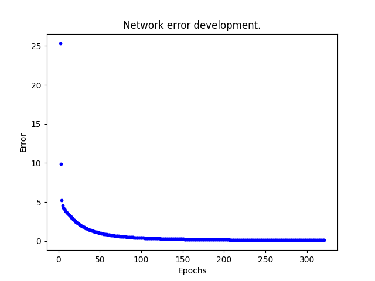

# Single Layer Network
Neural network with one layer which has multiple neurons.

In this example the network has 4 neurons. Each neuron approximate one logical gate function (OR, AND, NOR or NAND).

## Problem description
We have combinations of 2 bits as an input and want to output 4 different logical gate functions. That means that network that will approximate these gates will have 4 neurons (4 outputs) and will take 2 input values.

*Table of Input-Output combinations that should the network follow*

<table>
    <tr>
        <th colspan="2">Input</th>
        <th colspan="4">Output</th>
    </tr>
    <tr>
        <th>x1</th>
        <th>x2</th>
        <th>OR</th>
        <th>AND</th>
        <th>NOR</th>
        <th>NAND</th>
    </tr>
    <tr>
        <th>0</th>
        <th>0</th>
        <th>0</th>
        <th>0</th>
        <th>1</th>
        <th>1</th>
    </tr>
    <tr>
        <th>0</th>
        <th>1</th>
        <th>1</th>
        <th>0</th>
        <th>0</th>
        <th>1</th>
    </tr>
    <tr>
        <th>1</th>
        <th>0</th>
        <th>1</th>
        <th>0</th>
        <th>0</th>
        <th>1</th>
    </tr>
    <tr>
        <th>1</th>
        <th>1</th>
        <th>1</th>
        <th>1</th>
        <th>0</th>
        <th>0</th>
    </tr>
</table>

## Network function
The neural network is built from neurons. Each neuron has its own weights and bias. Each neuron has same input (all input values) so they need to have different parameters (weights and bias) so each works as different gate.

*Network scheme*

$z_j = \sum_{i}(w_{ji} * x_{ji}) + b_j$

$0 < j \leg number of neurons$

$y_j = f(z_j)$

Function *f(z)* iis referred to as an activation function where *z* represents the neuron potential.

## Network training
In this example supervised training principle was used. That means that network was trained with labeled training data.

Learning is an iterative process. In each iteration a network error value is count. This value is a summary of errors for each sample which are summaries of errors of each neuron. Goal is to minimize the error value by adjusting each neurons weights and bias.

Number of iterations can be set in two ways in this example. First one is to set number of epochs. Second one is to set a goal error value. Training will then go until the network error is lower than the set value.

*Network learning flowchart (with set goal error value)*

$n_e = label - output (n_e is error of 1 neuron for 1 sample)$

$s_e = \frac{1}{2} * \sum_i(n_{ei}^2) (s_e is sample error = errors of all neurons for 1 sample)$

$TN_e = \sum_i(s_{ei}) (TN_e is Total Network error)$

Parameters adjusting

$weights_{n+1} = weights_n + rate * n_e * \frac{d(output)}{dz} * x$

$bias_{n+1} = bias_n + rate * n_e * \frac{d(output)}{dz}$

*Rate means learning rate, d(output)/dz is derivation of activation function*

## Implementation
Neurons activation functions is a sigmoid function.

$f(x) = \frac{1}{1 + e^{-x}}&

$f(x)' = f(x) * (1 - f(x))$

Weights are stored in an matrix (rows = neurons, columns = weights) and biases in (neurons x 1) matrix. 

When creating a SingleLayerNetwork instance you must provide number of neurons and input size. Optionally you can provide starting weights and biases. If these are not provided random ones are generated from range 0 to 1.

When training you must provide training data and labels. Also you must set a number of training epochs or acceptable error value. Optionally you can set learning rate and plot network error as a function of epochs.

*Network error as a function of epochs*